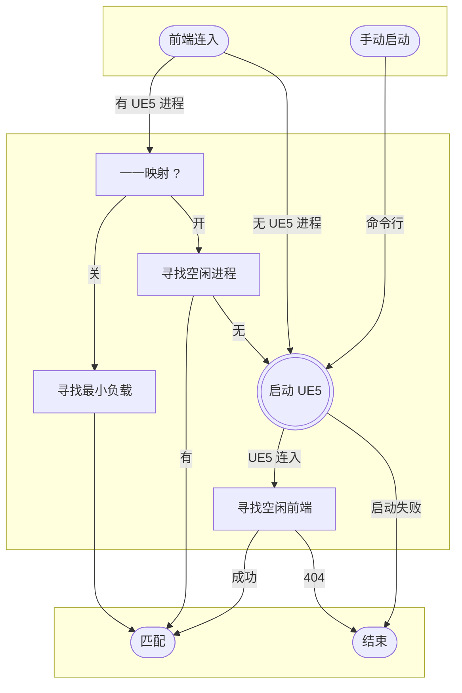

# 虚幻引擎 UE5 像素流 [中文](README-zh.md) [English](README.md)

和官方臃肿不堪的像素流SDK相比，我们在官方的基础上做了大量的优化和精简，并加入了许多新功能，开发出了轻量、零依赖、开箱即用的软件套装，前端的peer-stream.js基于WebComponentsAPI，后端signal.js基于NodeJS和npm/ws。

 | 文件名         | 大小  | 作用                             |
 | -------------- | ----- | -------------------------------- |
 | signal.js      | 16 KB | 信令服务器入口文件，通过node启动 |
 | peer-stream.js | 22 KB | 浏览器SDK，一键开启。            |
 | signal.json    | 1 KB  | signal.js 的启动参数。           |
 | signal.html    | 30+KB | 在线 GUI 配置页面。              |

# PeerStream企业版
团队另外推出了企业版，可以帮助大家更好的使用像素流，欢迎试用。 
软件可以免费使用，我们会一直维护，源码需要联系微信 g0415shenw  
https://github.com/inveta/PeerStreamEnterprise

## 示例

```s
# 启动信令服务器，读取配置signal.json
node signal.js

# 启动 UE5
start path/to/UE5.exe -PixelStreamingURL="ws://localhost:88"

# 打开测试网页
start http://localhost:88/signal.html
```

## signal.js 信令服务器

- 文件体积 15KB。
- 读取signal.json配置。
- 提供http文件服务，和WebSocket共享端口号。
- 面向前端和面向UE5的端口号绑定，通过WebSocket子协议区分。
- 通过环境变量统一传参，支持命令行或配置文件。
- 提供HTTP Basic用户名密码认证服务。
- 支持多个UE5连接。
- 控制台实时打印UE5和前端的多对多映射关系。
- 对WebSocket连接做节流过滤，提高稳定性。
- 支持UE5和前端一一映射。
- 前端连入时，可以自动启动UE5进程。
- 多个UE5连入时，负载均衡。
- 支持stun公网穿透，在公网间互连。
- 控制台可调式系统命令。
- 定时发送心跳连接保活。
- 前端的端口号与ID绑定。
- 即时打印当前上下文路径，方便查找文件。
- 自动嗅探网络IP地址。
- 向下兼容UE4。
- 支持Windows和Linux下的开机自启动。
  
### signal.json 启动参数

| 参数          | 类型       | 默认值 | 功能                             |
| ------------- | ---------- | ------ | -------------------------------- |
| PORT          | 正整数     | 88     | WebSocket/HTTP 全局统一端口号    |
| UE5           | 命令行列表 | []     | UE5自启动脚本池                  |
| one2one       | 开关       | false  | 限制UE5和前端一一映射            |
| auth          | 字符串     | ''     | HTTP Basic 认证的 "用户名:密码"  |
| boot          | 开关       | false  | 是否随开机启动signal.js          |
| exeUeCoolTime | 正整数     | 60     | 下次再启动同一个UE实例的时间间隔 |
| preload       | 正整数     | 1      | 预启动UE实例的个数               |
| iceServers    | 列表       | []     | 跨公网连接所需                   |
| comment       | 字符串     | ''     | 备注                             |

### 负载均衡与UE5自启动



## 虚幻引擎

启动插件，并在编辑器中测试:

```s
Plugins > Built-In > Graphics > Pixel Streaming > Enabled
Editor Preferences > Level Editor > Play > Additional Launch Parameters
start path/to/UE5.exe -{key}={value}
```

常用的启动选项:

| 参数                        | 类型 | 功能                         |
| --------------------------- | ---- | ---------------------------- |
| -PixelStreamingURL=""       | URL* | 连接signal.js的WebSocket地址 |
| -RenderOffScreen            | void | 后台渲染UE                   |
| -Unattended                 | void | 忽略错误弹窗                 |
| -GraphicsAdapter=0          | +int | 指定GPU                      |
| -ResX=1280 -ResY=720        | px²  | 渲染分辨率，搭配-ForceRes    |
| -PixelStreamingWebRTCFps=30 | fps  | 渲染帧率                     |
| -AudioMixer                 | void | 传输音频                     |

## peer-stream.js 前端开发包

- 文件22KB。
- 基于 Web Components API 组件化video标签。
- 断线自动重连。
- DOM生命周期绑定：挂载自动连接，卸载自动断开。
- 支持stun公网穿透。
- 全局挂载一份引用方便调试：window.ps。
- 支持5种键盘/鼠标/触屏输入模式。
- 支持视频自动播放。
- video标签的id即信令服务器地址，默认指向网页的域名。
- 支持异步请求。（不稳定）

### 引入

纯HTML写法:

```html
<script src="peer-stream.js"></script>
<video is="peer-stream" id="ws://127.0.0.1:88/" autoplay muted></video>
```

或者使用JavaScript:

```html
<script type="module">
import "peer-stream.js";
const ps = document.createElement("video", { is: "peer-stream" });
ps.id = "ws://127.0.0.1:88/";
document.body.append(ps);
</script>
```

### 字符串消息收发

发送消息:

```js
// 若传入对象，会被JSON化
ps.emitMessage(msg: string | object);
```

接收消息:

```js
ps.addEventListener("message", e => {
    // JSON.parse(e.detail)
});
```

异步请求：

```js
response = await ps.emitMessage(request);
// 返回不稳定
```

### video事件监听

```js
// https://developer.mozilla.org/en-US/docs/Web/HTML/Element/video#events
ps.addEventListener('事件名称', e => {
    // 回调函数
});
```

- "message":	接收应用层返回消息：e.detail。
- "playing":	场景开始渲染时，在该事件之后才能安全发送ps.emitMessage()。
- "suspend":	三维停止渲染时。
- "resize":	video元素被拉伸时。
- "pointerlockchange":	沉浸式鼠标切换时。
- "playerqueue":	返回用户排队情况，seq表示当前排队序号  
- "playerdisconnected":	signal不在线的回调事件 
- "ueDisConnected":	ue实例异常断开的的回调事件，企业版会触发这个事件[UE异常断线事件](https://github.com/inveta/PeerStreamEnterprise/wiki/5-UE%E5%BC%82%E5%B8%B8%E6%96%AD%E7%BA%BF%E4%BA%8B%E4%BB%B6)  

## signal.html 配置页面

- 文件体积 30+KB。
- 在线预览：https://inveta.github.io/peer-stream/signal.html#signal.json
- 在线可视化配置signal.json，实时生效。
- 端口号与信令共享。
- 在线预览peer-stream.js视频流。
- 后台进程监控。
- 实时监控所有用户和UE进程。
- 支持在线用户剔除。

## IOS端Safari兼容

由于IOS端Safari不支持自定义内置元素（customized built-in element），需要在peer-stream.js之前引入兼容包：https://github.com/ungap/custom-elements 。除此之外，IOS微信内置浏览器（小程序）禁止video自动播放，必须由用户行为（点击）触发调用ps.play()来播放视频流。

## 更新记录
1 2024-07-21 增加了对webrtc协议支持的检测，并进行提示  
2 2024-07-26 解决了输入IP地址访问 检测webrtc失败的bug  
3 2024-07-26 增加了ueDisConnected，便与应用层进行重连  
4 2024-08-05 增加了像素流中文的支持，需要配合企业版使用  